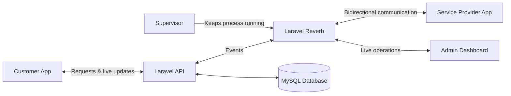

<!--
========================================================================
PORTFOLIO README
Replace the following values before publishing:

YOUR_GITHUB_USERNAME
YOUR_LINKEDIN_USERNAME
YOUR_EMAIL@example.com

Optional:
1. Upload your CV to: assets/Reem-Ramzy-Mohammed-CV.pdf
2. Replace or remove any project link you do not want to publish.
========================================================================
-->

  

  

---

## About Me

I am a **Full-Stack Developer** focused on building reliable backend systems, real-time platforms, custom administrative dashboards, booking workflows, and API integrations.

My commercial experience covers products in **transportation, home services, construction, tourism, hospitality, and financial point-of-sale systems**. I enjoy solving the parts of an application that connect everything together: business workflows, APIs, real-time events, databases, dashboards, and production deployment.

> **Current focus:** Laravel applications, real-time communication, system design, API integrations, maintainable code, and production reliability.

<table>
  <tr>
    <td width="25%" align="center">
      <strong>⚡ Real-Time Systems</strong>  
      Bidirectional events, live status changes, WebSockets, and operational monitoring.
    </td>
    <td width="25%" align="center">
      <strong>🧩 API Integration</strong>  
      Connecting external services to complete booking and business workflows.
    </td>
    <td width="25%" align="center">
      <strong>📊 Custom Dashboards</strong>  
      Administrative tools for clients, employees, reports, and daily operations.
    </td>
    <td width="25%" align="center">
      <strong>🛠️ Legacy Systems</strong>  
      Refactoring, debugging, maintenance, and safe feature delivery.
    </td>
  </tr>
</table>

---

## Technical Skills

  

### Core Areas

| Backend Development | Real-Time & Infrastructure | Frontend & Platforms |
|---|---|---|
| Laravel and PHP | Laravel Reverb | JavaScript |
| Python and Django | WebSockets | HTML and CSS |
| REST API development | Linux server deployment | Bootstrap |
| MySQL and database design | Supervisor process management | WordPress |
| Third-party API integration | Debugging and production support | Responsive interfaces |
| Legacy-code refactoring | Git and GitHub | Custom admin dashboards |

---

## How My Real-Time Systems Work

This architecture allows customers, service providers, and administrators to see request changes immediately while **Supervisor** keeps the real-time service running reliably on the production server.

---

# Featured Projects

> These are commercial production products. Their source code is private because of client and company confidentiality. The descriptions below focus only on **my role and direct contributions**.

 

<table>
  <tr>
    <td width="50%" valign="top">
      <h2 align="center">🚗 CarBreak</h2>
      
<strong>Real-Time Vehicle Services Platform</strong>

      

        An on-demand platform for valet parking, car washing, vehicle covering, and related car services. Customers can create requests and receive live updates throughout the service cycle.
      

      <h4>My Contribution</h4>
      <ul>
        <li>Implemented the complete bidirectional real-time workflow using <strong>Laravel Reverb</strong>.</li>
        <li>Connected customers, service providers, and administrators through live events and status updates.</li>
        <li>Configured and deployed <strong>Supervisor</strong> to keep the Reverb service continuously running.</li>
        <li>Developed a custom real-time dashboard for managing clients, employees, operations, and reports.</li>
      </ul>
      

        <code>Laravel</code>
        <code>Laravel Reverb</code>
        <code>WebSockets</code>
        <code>Supervisor</code>
        <code>MySQL</code>
      

      

        
        
        
      

    </td>
    <td width="50%" valign="top">
      <h2 align="center">✈️ TaNefer Tours</h2>
      
<strong>Tourism and Hotel Reservation Platform</strong>

      

        A full-service travel platform covering hotel reservations, flights, Nile cruises, day tours, and customized trips.
      

      <h4>My Contribution</h4>
      <ul>
        <li>Performed full-stack refactoring of an existing legacy codebase.</li>
        <li>Improved the code structure, maintainability, and stability of critical workflows.</li>
        <li>Implemented a complete hotel reservation cycle integrated with <strong>GTE</strong>.</li>
        <li>Worked across hotel search, availability, selection, booking, and reservation confirmation.</li>
      </ul>
      

        <code>Laravel</code>
        <code>PHP</code>
        <code>API Integration</code>
        <code>Legacy Refactoring</code>
        <code>Booking Workflows</code>
      

      

        
      

    </td>
  </tr>

  <tr>
    <td width="50%" valign="top">
      <h2 align="center">🏗️ ASAD</h2>
      
<strong>Construction Project Management Platform</strong>

      

        A platform that connects construction clients with the administration team and gives clients a clear view of project progress, documents, updates, and related information.
      

      <h4>My Contribution</h4>
      <ul>
        <li>Developed a custom administrative dashboard for the complete construction-management process.</li>
        <li>Connected the client application with the administrative workflow.</li>
        <li>Centralized project stages, client information, documents, progress updates, and operational data.</li>
        <li>Built tools that allowed administrators to manage what clients see inside the application.</li>
      </ul>
      

        <code>Custom Dashboard</code>
        <code>Laravel</code>
        <code>MySQL</code>
        <code>Client App Integration</code>
      

      

        
      

    </td>
    <td width="50%" valign="top">
      <h2 align="center">🔧 Motah</h2>
      
<strong>Real-Time Home Services Platform</strong>

      

        A home-maintenance platform that connects customers with technicians for services including electrical work, plumbing, air conditioning, and cleaning.
      

      <h4>My Contribution</h4>
      <ul>
        <li>Implemented the full real-time communication cycle using <strong>Laravel Reverb</strong>.</li>
        <li>Enabled live bidirectional updates between customers, technicians, and the administration system.</li>
        <li>Supported immediate request and service-status changes across the platform.</li>
        <li>Deployed and configured <strong>Supervisor</strong> to keep the real-time process stable in production.</li>
      </ul>
      

        <code>Laravel</code>
        <code>Laravel Reverb</code>
        <code>WebSockets</code>
        <code>Supervisor</code>
      

      

        
        
      

    </td>
  </tr>

  <tr>
    <td width="50%" valign="top">
      <h2 align="center">🚕 Move Now</h2>
      
<strong>Real-Time Transportation Platform</strong>

      

        A transportation and on-demand service platform that allows customers to request rides or services, view nearby providers, estimate prices, and follow progress on a live map.
      

      <h4>My Contribution</h4>
      <ul>
        <li>Implemented the full real-time request cycle using <strong>Laravel Reverb</strong>.</li>
        <li>Enabled bidirectional updates between customers, drivers or service providers, and administrators.</li>
        <li>Supported real-time status changes during the complete transportation workflow.</li>
        <li>Configured <strong>Supervisor</strong> on the production server for process reliability.</li>
      </ul>
      

        <code>Laravel</code>
        <code>Laravel Reverb</code>
        <code>WebSockets</code>
        <code>Supervisor</code>
        <code>Maps</code>
      

      

        
      

    </td>
    <td width="50%" valign="top">
      <h2 align="center">🧾 Fastich POS</h2>
      
<strong>Cloud-Based Point-of-Sale System</strong>

      

        A cloud POS platform for restaurants, cafés, food trucks, and retail businesses, supporting sales, cashier workflows, products, inventory, and reporting.
      

      <h4>My Contribution</h4>
      <ul>
        <li>Debugged and maintained the existing production application.</li>
        <li>Investigated reported defects and identified their technical causes.</li>
        <li>Fixed application issues while protecting existing business-critical workflows.</li>
        <li>Supported application stability and ongoing maintenance.</li>
      </ul>
      

        <code>Debugging</code>
        <code>Maintenance</code>
        <code>Production Support</code>
        <code>POS Workflows</code>
      

      

        
        
      

    </td>
  </tr>
</table>

---

## Additional Project

<table>
  <tr>
    <td width="100%" valign="top">
      <h2 align="center">🏝️ Venecia Resort</h2>
      
<strong>WordPress Resort and Booking Website</strong>

      

        A hospitality website created to present the resort, accommodation, facilities, and reservation information.
      

      <h4>My Contribution</h4>
      <ul>
        <li>Developed and configured the resort's WordPress website.</li>
        <li>Organized accommodation, facility, and hospitality content.</li>
        <li>Implemented the website's booking and reservation workflow.</li>
        <li>Created responsive pages for visitors across desktop and mobile devices.</li>
      </ul>
      

        <code>WordPress</code>
        <code>Booking Workflow</code>
        <code>Responsive Design</code>
        <code>Content Management</code>
      

      

        
        
      

    </td>
  </tr>
</table>

---

## What I Bring to a Development Team

<table>
  <tr>
    <td width="33%" valign="top">
      <h3>Business Understanding</h3>
      I translate operational requirements into practical application workflows instead of treating features as isolated technical tasks.
    </td>
    <td width="33%" valign="top">
      <h3>Production Ownership</h3>
      My work covers implementation, debugging, server-process configuration, deployment support, and long-term stability.
    </td>
    <td width="33%" valign="top">
      <h3>Maintainable Delivery</h3>
      I work carefully with existing systems, refactor legacy code safely, and avoid breaking active business functionality.
    </td>
  </tr>
</table>

---

## GitHub Activity

 

> Most of my professional work is stored in private company repositories, so public GitHub activity does not represent the full scope of my commercial experience.

---

## Currently Learning

- CI/CD pipelines and GitHub Actions
- Cloud deployment and infrastructure fundamentals
- Docker and container-based development
- Scalable backend architecture
- MLOps foundations and AI-service integration

---

# Contact

### Let's build something reliable.

I am open to **Backend**, **Laravel**, and **Full-Stack Development** opportunities.

 

  

